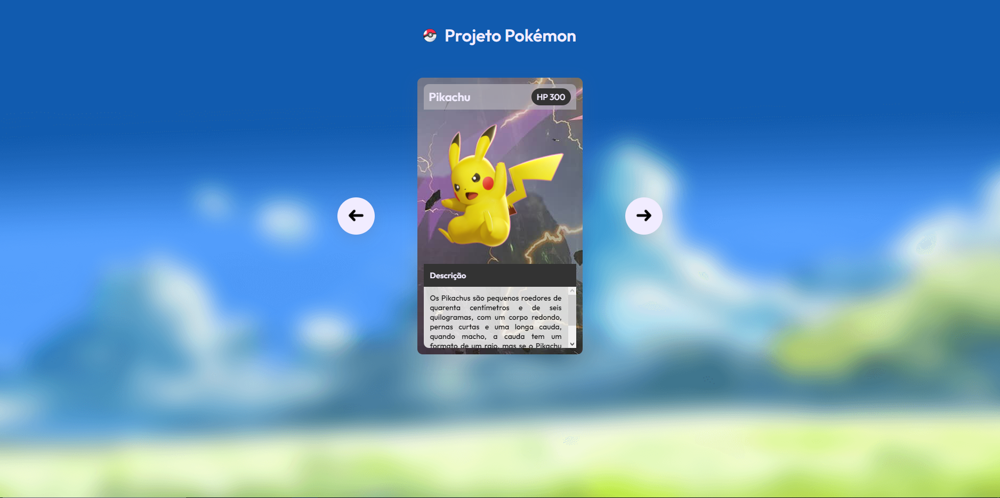

<h1> Carrosel de cartas pókemon </h1>

    
 Imagem do design da página 

    

Esse projeto foi desenvolvido junto a equipe DevEmDobro, durante um evento online onde o intuito era a criação de um projeto utilizando HTML, CSS e JavaScript

 Veja como ficou o projeto acessando o link a seguir. <a href="https://kaue-dev.github.io/projeto-pokemon-slider/">Acesse aqui!</a>

